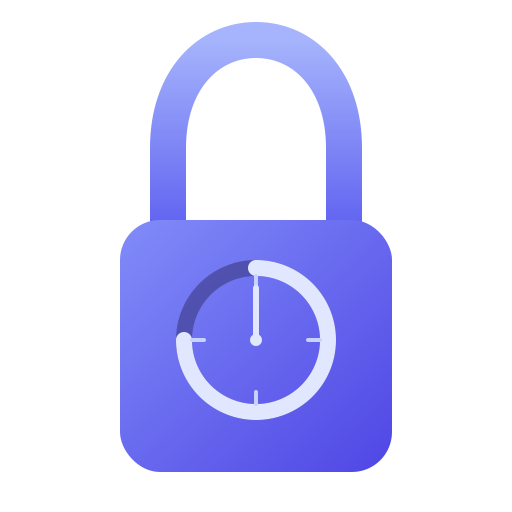

<p align="center">
  
</p>

<h1 align="center">MonkMode</h1>

<p align="center">A native macOS SwiftUI app that blocks distracting websites for a set duration.<br/>Once started, there is <b>no way to undo</b> the blocking until the timer expires — perfect for focused work sessions.</p>

Built with Swift 5.9+ and SwiftUI. Requires macOS 13 (Ventura) or later.

## Features

- **Dual-layer blocking** — DNS (`/etc/hosts` with IPv4 + IPv6 entries) + firewall (`pf`) for maximum effectiveness
- **Popular site presets** — One-click toggles for Instagram, Facebook, X, YouTube, TikTok, Reddit, LinkedIn
- **Custom domains** — Add any domain with enter-to-confirm chip input (validation rejects control chars, homoglyphs, IP-like strings)
- **Subdomain coverage** — Automatically blocks www, mobile, CDN, API, and platform-specific subdomains
- **DNS-over-HTTPS protection** — Blocks known DoH providers to prevent browser bypass
- **CIDR range blocking** — Blocks entire IP ranges for major platforms at the firewall level
- **Enforcer daemon** — Re-applies blocks every 60 seconds if you tamper with system files
- **Redundant cleanup** — Secondary LaunchDaemon fires at exact endTime as safety net
- **No sudo needed** — Uses the native macOS password dialog for privilege escalation
- **Full cleanup** — Everything is automatically restored when the timer expires (including disabling pf)

## Installation

### Option 1: DMG (Recommended)

1. Download the latest `MonkMode-X.X.X.dmg` from [Releases](https://github.com/gilbertsahumada/monk-mode/releases)
2. Mount the DMG and drag `SelfControl.app` to Applications
3. **First launch only** — the app is ad-hoc signed (not notarized with Apple), so macOS Gatekeeper will block it. Run this once in Terminal to allow it:
   ```bash
   xattr -cr /Applications/SelfControl.app
   ```
4. Open SelfControl from Applications — no further steps needed

### Option 2: Build from Source

```bash
git clone https://github.com/gilbertsahumada/monk-mode.git
cd monk-mode
swift build -c release
```

### Install Binaries

```bash
sudo cp .build/release/SelfControl /usr/local/bin/
sudo cp .build/release/SelfControlEnforcer /usr/local/bin/
```

## Usage

```bash
open /Applications/SelfControl.app
# or
.build/debug/SelfControl
```

The app opens a native macOS window:

### Setup

1. Toggle popular sites or type custom domains (comma-separated)
2. Set the duration (hours and minutes)
3. Click **Start Blocking** and confirm
4. Enter your admin password once — done

### Active Block

- Live countdown timer (adaptive: 1s/<1hr, 10s/<1hr, 60s/>1hr)
- Progress bar
- Blocked sites list with subdomain counts
- End time display

## How It Works

1. **DNS-level**: Redirects blocked domains to `127.0.0.1` via `/etc/hosts`
2. **Network-level**: Resolves domain IPs and creates `pf` firewall rules to block traffic
3. **DoH blocking**: Blocks DNS-over-HTTPS providers so browsers can't bypass `/etc/hosts`
4. **Privilege escalation**: Single `NSAppleScript` call with temp file execution
5. **Enforcer daemon**: LaunchDaemon that checks every 60 seconds and re-applies blocks if tampered with
6. **Smart re-apply**: Only writes files if hash changed (performance optimization)
7. **Auto-cleanup**: When timer expires, removes all hosts entries, firewall rules, **disables pf**, config files, and unloads itself

## Architecture

```
Sources/
  BlockSitesCore/       # Shared library — domain expansion, hosts generation, models
  BlockSitesApp/        # SwiftUI macOS app — UI, view models, privilege escalation
  BlockSitesEnforcer/   # Background daemon — re-enforces blocks every 60s
```

## Development

```bash
# Build
swift build
swift build -c release

# Test
swift test

# Create DMG
./scripts/build_dmg.sh

# Build landing page
cd web && yarn build
```

Landing page: `https://gilbertsahumada.github.io/monk-mode/`

Release instructions: see `RELEASE.md`.

## Troubleshooting

If sites remain blocked after the timer expires, see [TROUBLESHOOTING.md](TROUBLESHOOTING.md) for diagnosis and manual cleanup steps.

## Security

MonkMode runs a LaunchDaemon as root. Security reports are handled privately —
please **do not** open a public issue for a vulnerability. See
[SECURITY.md](SECURITY.md) for the disclosure policy and
[docs/THREAT_MODEL.md](docs/THREAT_MODEL.md) for the adversary model,
trust boundaries, and current mitigations.

In-code safeguards:

- `DomainValidator` rejects control characters, non-ASCII (Unicode
  homoglyphs), IP-like strings, and structural violations.
- `ShellQuote` quotes every value interpolated into the privileged bash
  script and escapes both the POSIX shell layer and the AppleScript
  string literal layer. Violations fail the build via the
  `AdversarialInputTests` corpus.
- Enforcer re-applies the block every 60 seconds and a secondary
  LaunchDaemon fires at exact `endTime` as redundancy.
- `CODEOWNERS` guards every privileged code path and the release pipeline.

## Warning

This tool is **intentionally difficult to bypass**. The only way to stop it early is:
- Reboot into Recovery Mode and modify system files
- Or just wait for the timer to expire

Use responsibly.

## Contributing

Contributions are welcome! Open an issue or submit a PR.

## License

[MIT](LICENSE)
